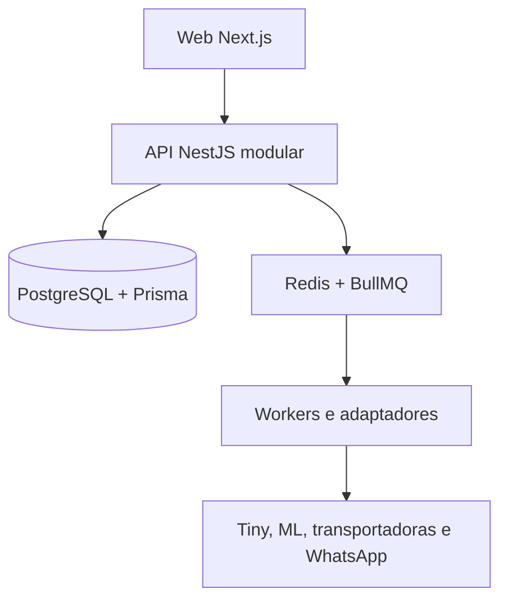
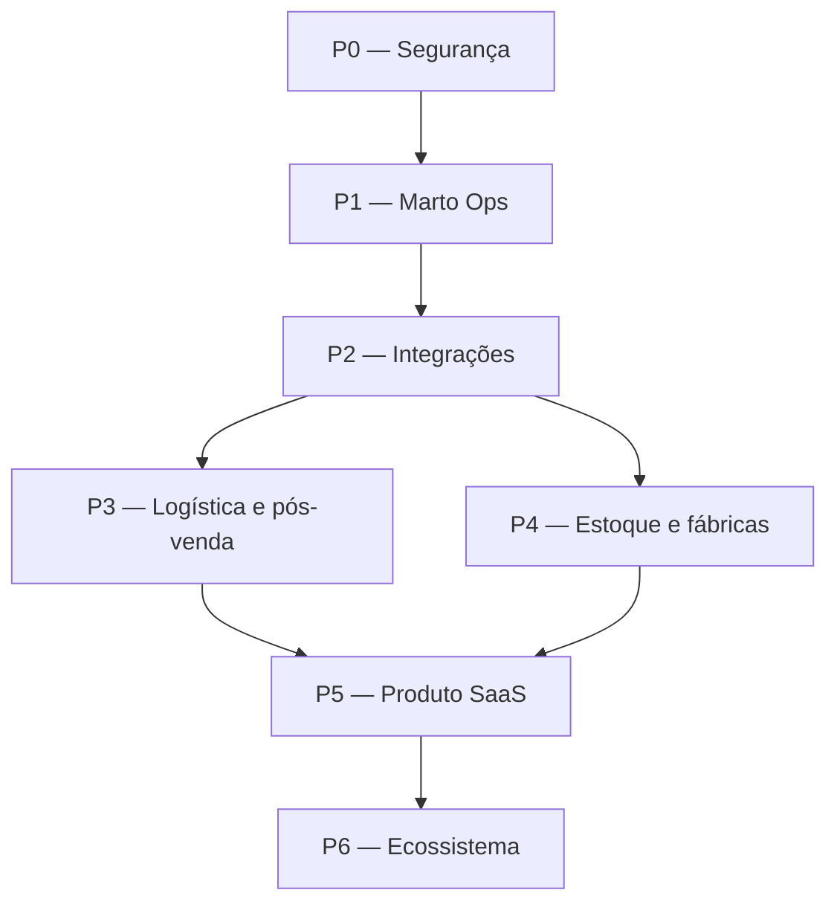

# Marto — Plano Mestre Arquitetural

Atualizado em: 18/07/2026
Estado: planejamento aprovado para detalhamento
Documento relacionado: `docs/MARTO-STATUS.md`

## 1. Objetivo deste plano

Este documento organiza a evolução do Marto em fases priorizadas.

Ele existe para impedir:

- perda de foco;
- construção desordenada;
- funcionalidades sem usuários;
- riscos de segurança;
- retrabalho arquitetural;
- esquecimento de dependências;
- crescimento sem controle dos dados;
- tentativa de construir o ecossistema inteiro ao mesmo tempo.

Cada fase possuirá seu próprio arquivo com checklist técnico completo, critérios de aceite, riscos, testes e definição de concluído.

## 2. Decisão estratégica principal

O Marto continuará sendo construído como um ecossistema completo.

Entretanto, sua entrada no mercado será feita pelo **Marto Ops**: uma central operacional para lojas e fábricas organizarem pedidos, prazos, estoque, transporte, rastreio, atendimento e assistência.

A estratégia será:

1. proteger a base atual;
2. colocar o Marto em uso real;
3. começar pela Store5;
4. atrair poucos usuários-piloto;
5. observar o trabalho diário;
6. resolver primeiro os problemas mais frequentes;
7. cobrar quando houver valor recorrente comprovado;
8. expandir gradualmente para o ecossistema completo.

Os módulos atuais de comércio, perfis, logística e reputação serão preservados, mas expansões que não ajudam o foco operacional ficarão temporariamente congeladas.

## 3. Resultado de negócio buscado

O Marto deverá se tornar o lugar em que uma loja ou fábrica começa e acompanha seu trabalho diário.

O usuário deverá conseguir responder rapidamente:

- Quais pedidos precisam de atenção?
- O que está atrasado?
- Qual é a próxima ação?
- Quem é responsável?
- O produto está disponível?
- A transportadora já coletou?
- Qual foi o valor da cotação?
- Onde está a mercadoria?
- O cliente foi avisado?
- Existe troca, devolução ou assistência?
- O que aconteceu desde a venda?

O valor inicial do Marto será reduzir desorganização, atraso, retrabalho e dependência de planilhas.

## 4. Princípios arquiteturais

### 4.1 Monólito modular primeiro

O Marto continuará como um monólito modular enquanto essa arquitetura suportar o produto.

Não serão criados microsserviços apenas por expectativa de crescimento futuro.

Separações físicas acontecerão somente quando existirem motivos comprovados, como:

- escala independente;
- isolamento de segurança;
- processamento pesado;
- necessidade operacional;
- equipe responsável separada;
- limitação técnica mensurável.

### 4.2 Servidor como fonte da verdade

O navegador nunca será a fonte definitiva para:

- preços;
- descontos;
- totais;
- permissões;
- estoque;
- pagamento;
- propriedade de recursos;
- transições de estado;
- regras de frete.

Esses dados deverão ser calculados ou validados no servidor.

### 4.3 Organização e isolamento

Dados empresariais deverão pertencer claramente a uma organização.

Toda consulta privada deverá validar:

- usuário autenticado;
- organização;
- papel;
- permissão;
- acesso ao recurso solicitado.

### 4.4 Histórico em vez de sobrescrita silenciosa

Ações importantes deverão gerar histórico.

Exemplos:

- alteração de status;
- mudança de prazo;
- troca de responsável;
- cotação recebida;
- coleta;
- atualização de rastreio;
- contato com cliente;
- movimentação de estoque;
- abertura e conclusão de assistência.

### 4.5 Integrações isoladas por adaptadores

Tiny, Mercado Livre, transportadoras, WhatsApp e futuros parceiros não deverão controlar diretamente o domínio central.

Cada integração deverá possuir:

- adaptador próprio;
- credenciais protegidas;
- mapeamento de dados;
- identificador externo;
- idempotência;
- tentativas automáticas;
- registro de erro;
- reconciliação;
- possibilidade de substituição.

### 4.6 Processamento assíncrono

Importações, rastreios, notificações e sincronizações deverão utilizar filas quando não precisarem acontecer dentro da resposta imediata da API.

Redis e BullMQ poderão processar:

- importação de pedidos;
- atualização de rastreio;
- alertas;
- sincronização de estoque;
- envio de mensagens;
- reconciliação;
- tarefas programadas.

### 4.7 Evolução segura do banco

Toda mudança de banco deverá possuir:

- finalidade;
- migration;
- análise de dados existentes;
- compatibilidade;
- plano de implantação;
- possibilidade de recuperação;
- teste antes da produção.

### 4.8 Funcionalidades controladas

Funcionalidades novas ou incompletas deverão utilizar controle de ambiente ou feature flag.

Recursos mock não poderão ficar acessíveis em produção.

## 5. Arquitetura-alvo da próxima fase

Responsabilidades:

| Componente | Responsabilidade |
|---|---|
| Web | Interface, navegação e experiência |
| API | Autenticação, autorização e regras de negócio |
| PostgreSQL | Fonte persistente dos dados |
| Prisma | Modelos, consultas e migrations |
| Redis/BullMQ | Filas, tentativas e tarefas agendadas |
| Workers | Integrações e processamento em segundo plano |
| Adaptadores | Traduzir sistemas externos para o domínio Marto |

## 6. Domínios principais

| Domínio | Responsabilidade |
|---|---|
| Identidade | Usuário, perfil e autenticação |
| Organizações | Empresas, equipes e isolamento |
| Permissões | Papéis e acesso aos recursos |
| Catálogo | Produtos, imagens e ficha técnica |
| Pedidos | Compra, itens, valores e estados |
| Operações | Prioridades, responsáveis, tarefas e prazos |
| Estoque | Saldo, reserva e movimentação |
| Logística | Cotação, remessa, coleta e entrega |
| Assistência | Trocas, devoluções, defeitos e solução |
| Integrações | Tiny, ML e canais externos |
| Comunicações | Mensagens, modelos e histórico |
| Reputação | Avaliações e experiências verificadas |
| Pagamentos | Cobranças e confirmação financeira |
| Auditoria | Histórico de ações importantes |
| Métricas | Uso, desempenho e resultado do produto |

## 7. Prioridade das funcionalidades

| Ordem | Funcionalidade | Impacto | Motivo |
|---:|---|---|---|
| 1 | Segurança e integridade | Crítico | Evita prejuízo, vazamento e perda de dados |
| 2 | Central unificada de pedidos | Muito alto | Cria o local de trabalho diário |
| 3 | Prazos, prioridades e próxima ação | Muito alto | Mostra imediatamente o que precisa ser feito |
| 4 | Importação do Tiny | Muito alto | Elimina digitação e traz pedidos reais |
| 5 | Histórico operacional | Alto | Evita informação perdida |
| 6 | Cotação, coleta e rastreio | Muito alto | Resolve uma dor frequente da operação |
| 7 | Atendimento e assistência | Alto | Organiza problemas após a venda |
| 8 | Mensagens controladas | Alto | Reduz trabalho manual e melhora comunicação |
| 9 | Estoque operacional | Alto | Evita venda sem disponibilidade |
| 10 | Integração Mercado Livre | Alto | Amplia pedidos reais centralizados |
| 11 | Relatórios e indicadores | Médio | Melhora decisões após existir dado confiável |
| 12 | Expansão do ecossistema | Estratégico | Acontece depois da validação do núcleo |

## 8. Dependências principais

Regras de dependência:

- usuários reais dependem de isolamento e segurança;
- integrações dependem de um modelo canônico de pedido;
- rastreio depende de remessas e transportadoras identificadas;
- estoque depende de movimentações e idempotência;
- automações dependem de auditoria e tratamento de erros;
- cobrança depende de valor recorrente comprovado;
- escala depende de observabilidade, suporte e recuperação;
- ecossistema depende de uso recorrente do núcleo operacional.

## 9. Visão geral das fases

| Fase | Nome | Impacto | Dependência | Situação |
|---|---|---|---|---|
| P0 | Segurança e integridade | Crítico | Documentação inicial | Próxima |
| P1 | Marto Ops utilizável | Muito alto | P0 | Bloqueada |
| P2 | Integrações confiáveis | Muito alto | P0 e P1 | Bloqueada |
| P3 | Logística e pós-venda | Muito alto | P1 e P2 | Bloqueada |
| P4 | Estoque e fábricas | Alto | P1 e P2 | Bloqueada |
| P5 | Produto SaaS e crescimento | Alto | P1 a P4 | Bloqueada |
| P6 | Ecossistema Marto | Estratégico | Tração comprovada | Bloqueada |

As janelas abaixo são estimativas de planejamento, não promessas de prazo. Cada fase será recalculada depois de seu checklist técnico.

## 10. P0 — Segurança e integridade

### Objetivo

Garantir que a base atual possa receber usuários e dados reais sem riscos críticos conhecidos.

### Janela indicativa

2 a 4 semanas de execução focada.

### Entregas principais

- inventário de rotas privadas;
- matriz de papéis e permissões;
- validação de propriedade dos recursos;
- preços calculados no servidor;
- revisão de pedidos e pagamentos;
- bloqueio de mocks em produção;
- revisão da estratégia de sessão;
- proteção de segredos;
- validação de variáveis de ambiente;
- revisão de CORS e limites de requisição;
- validação de entradas;
- isolamento entre organizações;
- auditoria das ações críticas;
- revisão do schema Prisma;
- processo seguro de migration;
- backup e teste de restauração;
- testes de fluxos críticos;
- build e verificações no CI;
- monitoramento básico de erros;
- documentação de implantação.

### Critério para concluir

A fase somente poderá ser concluída quando:

- nenhuma rota crítica depender apenas do frontend;
- preços não puderem ser manipulados pelo cliente;
- recursos privados validarem o proprietário;
- mocks estiverem inacessíveis em produção;
- segredos não estiverem no repositório;
- migrations forem reproduzíveis;
- backup e restauração forem testados;
- testes críticos passarem;
- build da API e da Web passarem;
- riscos restantes estiverem documentados e aceitos.

## 11. P1 — Marto Ops utilizável

### Objetivo

Criar a primeira versão que uma loja consiga utilizar diariamente para trabalhar.

### Janela indicativa

4 a 6 semanas após P0.

### Entregas principais

- organização empresarial;
- membros e permissões básicas;
- central unificada de pedidos;
- visão por prioridade;
- próxima ação;
- responsável;
- prazo;
- filtros e busca;
- histórico do pedido;
- comentários internos;
- tarefas;
- alertas;
- importação manual ou CSV controlada;
- visão de atrasos;
- visão de pedidos sem ação;
- operação-piloto da Store5;
- métricas de uso;
- coleta de feedback.

### Critério para concluir

- Store5 utiliza o sistema em dias reais de operação;
- pedidos podem ser encontrados rapidamente;
- cada pedido importante possui próxima ação;
- atrasos aparecem sem depender de planilha;
- ações importantes possuem histórico;
- não existem duplicações silenciosas;
- problemas encontrados no piloto estão registrados;
- o sistema economiza trabalho em pelo menos um fluxo diário.

## 12. P2 — Integrações confiáveis

### Objetivo

Trazer pedidos reais automaticamente sem comprometer integridade ou segurança.

### Janela indicativa

3 a 5 semanas após estabilização do núcleo operacional.

### Ordem de integração

1. Tiny ERP;
2. Mercado Livre;
3. outros canais conforme demanda real.

### Entregas principais

- arquitetura de adaptadores;
- credenciais protegidas;
- modelo canônico de pedido;
- identificadores externos;
- importação idempotente;
- sincronização incremental;
- paginação;
- limites de API;
- filas;
- tentativas automáticas;
- fila de falhas;
- logs;
- reconciliação;
- reprocessamento manual;
- painel de saúde da integração;
- mapeamento de status;
- testes com dados reais controlados.

### Critério para concluir

- o mesmo pedido não é criado duas vezes;
- falhas não causam perda silenciosa;
- importações podem ser reprocessadas;
- credenciais não aparecem em logs;
- o usuário sabe quando ocorreu a última sincronização;
- divergências podem ser identificadas;
- o Tiny funciona antes de iniciar a integração seguinte.

## 13. P3 — Logística e pós-venda

### Objetivo

Centralizar o trabalho que acontece após a venda.

### Janela indicativa

4 a 6 semanas.

### Entregas principais

- cadastro de transportadoras;
- contatos e regiões atendidas;
- solicitação de cotação;
- histórico de cotações;
- comparação de preço e prazo;
- seleção da transportadora;
- agendamento de coleta;
- registro de coleta;
- rastreio;
- alertas de atraso;
- histórico de comunicação;
- modelos de mensagem;
- envio controlado;
- atendimento;
- troca;
- devolução;
- avaria;
- assistência;
- responsável e SLA;
- fila de exceções;
- indicadores operacionais.

### Regra de automação

Primeiro o Marto deverá:

1. montar a mensagem;
2. permitir revisão humana;
3. registrar o envio;
4. acompanhar a resposta.

Envios totalmente automáticos somente serão ativados depois que o fluxo manual controlado estiver validado.

### Critério para concluir

- uma cotação fica vinculada ao pedido;
- a transportadora escolhida fica registrada;
- coleta e rastreio possuem histórico;
- atrasos geram alerta;
- assistências possuem responsável e prazo;
- contatos com o cliente não ficam apenas no WhatsApp;
- a operação consegue trabalhar sem consultar várias planilhas.

## 14. P4 — Estoque e fábricas

### Objetivo

Criar um controle de estoque confiável conectado aos pedidos e à operação das fábricas.

### Janela indicativa

4 a 8 semanas.

### Entregas principais

- produto e SKU;
- depósitos e localizações;
- saldo físico;
- saldo disponível;
- reservas;
- entradas;
- saídas;
- ajustes;
- transferências;
- inventário;
- motivo da movimentação;
- usuário responsável;
- custo;
- estoque mínimo;
- alertas de reposição;
- vínculo com pedidos;
- reconciliação com ERP;
- prevenção de movimentações duplicadas;
- visão de fábrica;
- produção e disponibilidade futura.

### Regra central

Estoque não será apenas um número editável.

O saldo deverá ser resultado de movimentações registradas e auditáveis.

### Critério para concluir

- toda alteração possui origem;
- pedidos reservam estoque com segurança;
- cancelamentos liberam reservas;
- divergências podem ser reconciliadas;
- movimentos externos são idempotentes;
- inventário não apaga histórico;
- a operação conhece saldo físico e disponível.

## 15. P5 — Produto SaaS e crescimento

### Objetivo

Transformar o Marto Ops validado em um produto que novas empresas possam contratar e utilizar.

### Janela indicativa

4 a 8 semanas após validação dos pilotos.

### Entregas principais

- onboarding;
- criação de organização;
- convite de membros;
- papéis administrativos;
- planos;
- limites;
- assinatura;
- cobrança;
- período de teste;
- suporte;
- central de ajuda;
- métricas por organização;
- observabilidade;
- gestão de incidentes;
- exportação de dados;
- exclusão e privacidade;
- requisitos da LGPD;
- backups automatizados;
- recuperação de desastre;
- desempenho;
- disponibilidade;
- processo de implantação;
- comunicação de mudanças.

### Critério para concluir

- uma empresa consegue iniciar com pouca ajuda;
- permissões funcionam por organização;
- cobrança é rastreável;
- dados podem ser exportados;
- incidentes possuem procedimento;
- backup e recuperação são testados;
- existe evidência de uso recorrente;
- usuários demonstram disposição para pagar.

## 16. P6 — Ecossistema Marto

### Objetivo

Expandir o produto operacional validado para a visão completa do Marto.

### Possibilidades

- marketplace;
- catálogo ampliado;
- rede de lojas;
- rede de fábricas;
- prestadores;
- transportadoras;
- representantes;
- reputação verificada;
- Marto Social;
- Marto Copilot;
- recomendações;
- dados para indústria;
- anúncios internos;
- serviços financeiros;
- Marto Pay;
- carteira;
- crédito;
- fundo Marto.

### Condição para iniciar

Essa fase não começará apenas porque as ideias são interessantes.

Será necessário possuir:

- núcleo operacional estável;
- usuários recorrentes;
- dados confiáveis;
- segurança comprovada;
- suporte operacional;
- modelo de receita;
- evidência de demanda.

## 17. Plano de entrada de usuários

### Estágio A — Operação interna

Usuário principal: Store5.

Objetivos:

- usar pedidos reais;
- observar tarefas repetitivas;
- medir tempo;
- identificar falhas;
- corrigir fluxo.

### Estágio B — Parceiros de desenvolvimento

Quantidade inicial: 1 a 3 empresas.

Objetivos:

- validar necessidades diferentes;
- testar onboarding;
- descobrir regras não previstas;
- evitar construir apenas para uma empresa.

### Estágio C — Piloto comercial

Quantidade inicial: 5 a 10 empresas.

Objetivos:

- validar recorrência;
- validar suporte;
- validar preço;
- acompanhar retenção;
- avaliar estabilidade.

### Estágio D — Crescimento controlado

Somente depois de:

- segurança;
- estabilidade;
- uso recorrente;
- suporte;
- métricas;
- recuperação de falhas.

## 18. Métricas importantes

### Ativação

- tempo até importar o primeiro pedido;
- tempo até concluir a primeira ação;
- porcentagem de empresas que concluem o onboarding.

### Uso

- organizações ativas por semana;
- usuários ativos por organização;
- pedidos processados;
- pedidos com próxima ação;
- tarefas concluídas;
- cotações registradas;
- rastreios acompanhados;
- assistências resolvidas.

### Qualidade

- pedidos duplicados;
- falhas de sincronização;
- ações sem histórico;
- divergências de estoque;
- erros de autorização;
- tempo de recuperação;
- atrasos não identificados.

### Valor

- tempo economizado;
- redução de planilhas;
- redução de esquecimentos;
- redução do tempo de resposta;
- retenção semanal;
- empresas dispostas a pagar.

Métricas de vaidade não deverão passar à frente de uso recorrente e resultado operacional.

## 19. Riscos arquiteturais

| Risco | Consequência | Mitigação |
|---|---|---|
| Crescimento de escopo | Projeto nunca chega ao uso real | Congelar expansões fora da fase |
| Falha de autorização | Vazamento ou alteração indevida | Matriz de acesso e testes |
| Preço vindo do frontend | Prejuízo financeiro | Cálculo no servidor |
| Dados duplicados | Operação incorreta | Idempotência e identificadores externos |
| Integração indisponível | Pedidos desatualizados | Filas, tentativas e reconciliação |
| Credenciais expostas | Comprometimento de contas | Criptografia e gestão de segredos |
| Migration insegura | Perda de dados | Backup, teste e plano de implantação |
| Automação prematura | Mensagens ou ações erradas | Confirmação humana inicial |
| Produto feito para um usuário | Baixa capacidade de expansão | Pilotos com empresas diferentes |
| Falta de métricas | Decisões por impressão | Eventos e indicadores desde o piloto |
| Microsserviços prematuros | Complexidade operacional | Monólito modular |
| Dependência de fornecedor | Bloqueio do produto | Adaptadores substituíveis |
| Falta de suporte | Perda de confiança | Processo de incidentes e auditoria |

## 20. SLA interno de execução

Este SLA é uma regra interna de prioridade, não um contrato comercial.

| Severidade | Exemplo | Resposta esperada |
|---|---|---|
| Crítica | Vazamento, perda de dados, acesso indevido, manipulação financeira | Parar outras tarefas e tratar imediatamente |
| Alta | Operação-piloto bloqueada, pedidos duplicados, integração interrompida | Analisar no mesmo dia útil |
| Média | Erro com alternativa manual disponível | Planejar na fase atual |
| Baixa | Melhoria visual ou conveniência | Registrar no backlog |

Nenhuma funcionalidade nova deverá avançar enquanto existir risco crítico aberto relacionado ao mesmo fluxo.

## 21. Meta operacional futura

Quando o Marto estiver atendendo clientes reais, os alvos iniciais serão:

- nenhuma perda silenciosa de pedido;
- nenhuma duplicação aceita como normal;
- ações críticas auditadas;
- falhas de integração visíveis;
- tentativas automáticas controladas;
- backup diário;
- restauração testada;
- incidentes críticos tratados imediatamente;
- usuário informado quando uma sincronização estiver atrasada.

Essas metas serão transformadas em indicadores mensuráveis durante P5.

## 22. Definição de pronto para iniciar uma tarefa

Uma tarefa somente poderá começar quando possuir:

- problema definido;
- usuário afetado;
- resultado esperado;
- escopo limitado;
- arquivos relacionados identificados;
- dependências conhecidas;
- risco avaliado;
- critério de aceite;
- forma de testar.

## 23. Definição de concluído

Uma tarefa somente será concluída quando:

- implementação estiver limitada ao escopo;
- build relacionado passar;
- TypeScript estiver sem novos erros;
- testes relacionados passarem;
- autorização tiver sido verificada;
- dados existentes forem preservados;
- logs não expuserem informações sensíveis;
- fluxo anterior continuar funcionando;
- documentação for atualizada;
- arquivos alterados forem informados;
- riscos restantes forem registrados;
- usuário validar o resultado.

## 24. Regras de bloqueio

Não será permitido:

- ampliar o marketplace antes de resolver P0;
- colocar pagamento mock em produção;
- aceitar preço calculado pelo cliente;
- automatizar mensagens sem histórico;
- integrar vários ERPs antes de estabilizar o Tiny;
- editar estoque sem movimentação auditável;
- iniciar microsserviços sem necessidade comprovada;
- executar migration destrutiva para ganhar tempo;
- guardar segredo no repositório;
- iniciar P6 sem usuários recorrentes.

## 25. Organização dos documentos

Arquivos de planejamento:

- `docs/MARTO-STATUS.md`;
- `docs/MARTO-MASTER-PLAN.md`;
- `docs/phases/P0-SEGURANCA-E-INTEGRIDADE.md`;
- `docs/phases/P1-MARTO-OPS.md`;
- `docs/phases/P2-INTEGRACOES.md`;
- `docs/phases/P3-LOGISTICA-E-POS-VENDA.md`;
- `docs/phases/P4-ESTOQUE-E-FABRICAS.md`;
- `docs/phases/P5-PRODUTO-SAAS.md`;
- `docs/phases/P6-ECOSSISTEMA.md`.

Cada arquivo de fase deverá conter:

- objetivo;
- contexto;
- escopo incluído;
- escopo excluído;
- dependências;
- checklist;
- riscos;
- testes;
- critérios de aceite;
- métricas;
- SLA;
- plano de reversão;
- definição de concluído;
- registro de decisões;
- andamento.

## 26. Próxima ação oficial

Após salvar e aprovar este plano, o próximo documento será:

`docs/phases/P0-SEGURANCA-E-INTEGRIDADE.md`

Nenhuma implementação ampla deverá começar antes da criação do checklist completo da P0.

## 27. Regra final

O Marto crescerá com ambição, mas será construído com foco.

Primeiro:

- segurança;
- operação real;
- usuários;
- dados;
- recorrência;
- receita.

Depois:

- expansão;
- rede;
- inteligência;
- serviços financeiros;
- ecossistema completo.

Uma coisa por vez, com cada avanço fortalecendo o próximo.
